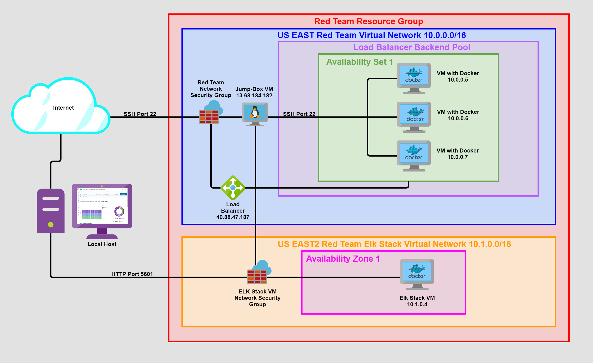

# ELK Stack Deployment

___

Created by: **Adam Borel**

___

The files in this repository were used to configure a cloud based network, depicted visually in this diagram below:

These files are used to generate a live ELK deployment on Azure. They can be used to either recreate the entire deployment pictured above. Accessible below, select portions of the YAML Playbook files, which can be used to install only certain pieces the ELK stack in Azure. , such as Filebeat.
>### 

**This document contains the following details:**

- Description of the Topology
 - Access Policies
 - ELK Configuration
   - Beats in Use
   - Machines Being Monitored
- How to Use the Ansible Build

___

### Description of the Topology

The main purpose of this network is to expose a load-balanced and monitored instance of DVWA, the Damn Vulnerable Web Application.

Load balancing ensures that the application will be highly accessible, in addition to restricting access to the network.

- Load balancers protect the availability of services by ensuring network traffic is distributed effectively. If one DVWA VM goes down the other two will pick up the slack.
- A Jump Box is advantageous due to it's function as a gateway to private servers and services behind a Jump Box adds another level of security.

Integrating an ELK server allows users to easily monitor the vulnerable VMs for changes to the log files and system resources.

- Filebeat searches specific log files and sends them to Elasticsearch for logging and review.
- Metricbeat records the metrics from a servers' systems and services, then sends that data to Elasticsearch. 

The configuration details of each machine can be found below:

| Virtual Machines | Functions | IP Addresses | Operating Systems |
|:-|:-|:-|:-:|
| Jump Box                          |       Gateway       | 10.0.0.4                               | Linux: Ubuntu 18.04   (*1 vCPU 1GB RAM*) |
| (*Web 1*) (*Web 2*) (*Web 3*)     |    DVWA Webservers  | (*10.0.0.5*) (*10.0.0.6*) (*10.0.0.7*) | Linux: Ubuntu 18.04   (*1 vCPU 2GB RAM*) |
| ELK Stack                         | ElasticSearch Stack | 10.1.0.4                               | Linux: Ubuntu 18.04   (*2 vCPU 8GB RAM*) |

___

### Access Policies

The machines on the internal network are not exposed to the public Internet.

Only the JumpBox/Ansible VM machine can accept connections from the Internet. Access to this machine is only allowed from the following IP address:

- My local machines' Public IP Address (*45.51.99.176*)

Machines within the network can only be accessed by the Jump Box:

- Jump Box
  - Public IP Jump Box: (*13.68.184.182*)
  - Private IP Jump Box: (*10.0.0.4*)

A summary of the access policies in place can be found in the table below:

| NAME | PUBLICLY ACCESSIBLE *(Y/N)* | ALLOWED IP ADDRESSES |
|:-|:-|:-|
| Jump Box VM                        | Yes - (*SSH Port 22*)                                       | (*Personal Public IP Address*)                |
| VMs: (*Web 1*) (*Web 2*) (*Web 3*) | NO                                                          | (*Webserver Load Balancer Public IP Address*) |
| Webserver Load Balancer            | Yes - (*HTTP Port 80*)                                      | Any                                           |
| ELK Stack Log Monitoring           | Yes - ( *Kibana port:5601*) (*API calls on HTTP Port:9200*) | (*Kibana - Any*) (*HTTP API - 10.0.0.0/16*)   |---

___

### Elk Configuration

Ansible was used to automate configuration of the ELK machine. No configuration was performed manually, which is advantageous because...

- We are able to repeat the process over and over again without errors that humans might introduce into the equation.

The playbook implements the following tasks:

- `Install docker` (*Installs Docker code to the server selected*)
- `Install Python3-pip module` (*Installs the pip module which deals with packet management*)
- `Install Docker Module` (*Installs Docker modules for pip*)
- `Increase/USE more Memory` (*Provides enough memory for the ELK server to run*)
- `Download and launch ELK container` (*Downloads and launches the ELK container through specific ports*)

The screenshot below displays the result of running `docker ps` after successfully configuring the ELK instance:

___

### Target Machines & Beats

This ELK server is configured to monitor the following machines:

- DVWA-1 (*10.0.0.5*)
- DVWA-2 (*10.0.0.6*)
- DVWA-3 (*10.0.0.7*)

We have installed the following Beats on these machines:

- DVWA-1 (*FileBeat & MetricBeat*)
- DVWA-2 (*Filebeat & MetricBeat*)
- DVWA-3 (*FileBeat & MetricBeat*)

These Beats allow us to collect the following information from each machine:

- Filebeat (*Collects log data*)
- MetricBeat (*Collects data from system usage*)

___

### Using the Playbook

In order to use the playbook, you will need to have an Ansible control node already configured. Assuming you have such a control node provisioned:

SSH into the control node and follow the steps below:

- Copy the `ELK-Install.YML` file to the `/etc/ansible/roles` directory.
- Update the `hosts` file to include the name and IP address of the server you wish to install ELK on.
  
  >    
- Run the playbook, and navigate to `http://[your_elk_server_ip]:5601/app/kibana` to check that the installation worked as expected.
